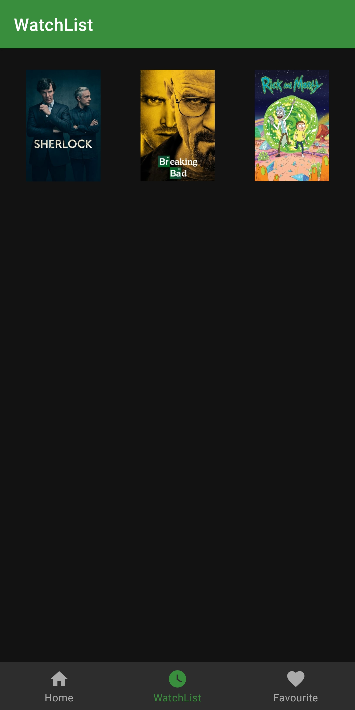

# MovieGuide

Simple Android App to search for movies and TV Shows, and manage watch lists and many more. 

## Details
- **Programming Language**: Java
- **Architecture** : [MVVM and Data Binding](https://developer.android.com/jetpack/guide)
- **Image Loading** : [Glide](https://github.com/bumptech/glide)
- **Navigation** : [Navigation Component](https://developer.android.com/guide/navigation/navigation-getting-started)
- **Network Operations** : [Fast Android Networking Library](https://github.com/amitshekhariitbhu/Fast-Android-Networking)
- **Design** : [Material Design](https://material.io)
## Screenshots

